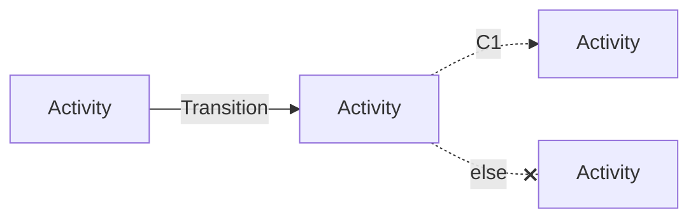
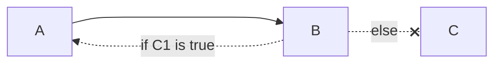
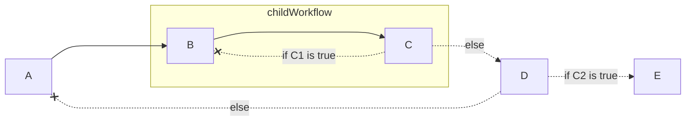
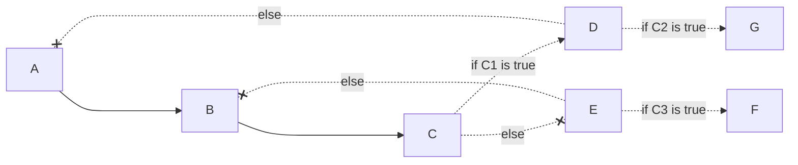

# Questions about Temporal

For each question we draw a diagram which looks like the following:

Additionally, we will link to our own perception of the correct implementation for Temporal on how to handle the situation.
Feel free to create a PR if you have a better solution.

## How to handle 'loops'?

See [our solution](./loops-solution) based on the [continueAsNew API](https://docs.temporal.io/dev-guide/typescript/features#continue-as-new)
 and [example](https://github.com/temporalio/samples-typescript/tree/main/continue-as-new).

## How to handle overlapping 'loops'?

See [our solution](./overlapping-loops-solution) based on the [continueAsNew API](https://docs.temporal.io/dev-guide/typescript/features#continue-as-new)
and [example](https://github.com/temporalio/samples-typescript/tree/main/continue-as-new).

## How to handle crossing 'loops'?
This is probably the most complex case, as it there are multiple transitions going 'backward'.

See [our solution](./crossing-loops-solution) based on the [continueAsNew API](https://docs.temporal.io/dev-guide/typescript/features#continue-as-new)
and [example](https://github.com/temporalio/samples-typescript/tree/main/continue-as-new).