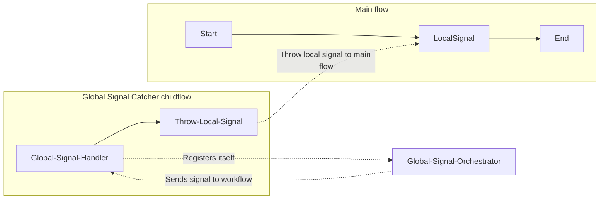

# Global/local signal workflow with data.

## Prerequisites

1. Node 22

## Installation

In order to install all dependencies and format all files, run the following
command:

```shell
chmod +x install.sh && ./install.sh
```

### Running this sample

1. `temporal server start-dev` to start
   [Temporal Server](https://github.com/temporalio/cli/#installation).
2. In another shell, `npm run start.watch` to start the Worker.
3. In another shell, `npm run workflow` to run the Workflow Client.
4. Send a signal from the Temporal Web UI to the running global signal catcher
   workflow.

### Workflow

In this example, we start a global signal catcher as a child flow, running in
parallel with the main workflow. The global signal catcher notifies the parent
workflow with a local signal when a signal is caught. Local signal handlers are
registered in the main workflow to catch the signal.
When the main flow is done, the global signal catchers are terminated using a signal.
The global signal catchers are registered and terminated in the global signal orchestrator.


