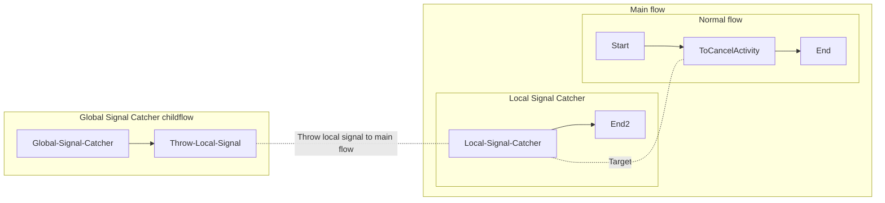

# Local signal workflow cancellation using cancellation scopes

This is the default project that is scaffolded out when you run `.......`.

## Prerequisites

1. Node 22

## Installation

In order to install all dependencies and format all files, run the following command:

```shell
chmod +x install.sh && ./install.sh
```

### Running this sample

1. `temporal server start-dev` to start [Temporal Server](https://github.com/temporalio/cli/#installation).
2. `npm run start.watch` to start the Worker.
3. In another shell, `npm run workflow` to run the Workflow Client.
4. In another shell, `npm run cancel-workflow {workflowId}` to cancel the Workflow Client.

### Workflow


