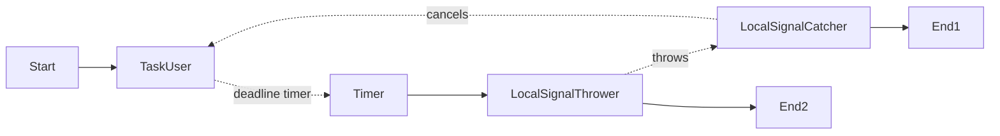

# Local signal workflow cancellation using cancellation scopes

This is the default project that is scaffolded out when you run `.......`.

## Prerequisites

1. Node 22

## Installation

In order to install all dependencies and format all files, run the following command:

```shell
chmod +x install.sh && ./install.sh
```

### Running this sample

1. `temporal server start-dev` to start [Temporal Server](https://github.com/temporalio/cli/#installation).
2. `npm run start.watch` to start the Worker.
3. In another shell, `npm run workflow` to run the Workflow Client.

### Workflow

In this example, we start a global signal catcher as a child flow, running in parallel with the main workflow.
The global signal catcher notifies the parent workflow with a local signal when a signal is caught.
Local signal handlers are registered in the main workflow to catch the signal.
Each signal target activity sets a handler when the activity starts.
When a signal is caught, the signal handler cancels the target activity’s cancellation scope.
The target activity is canceled, and the workflow continues (possibly along a different workflow path).



