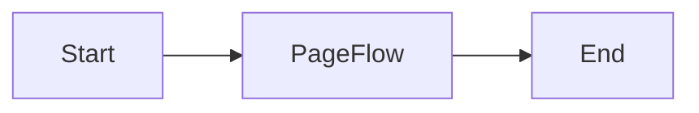

# Page flow task user activity implementation

## Prerequisites

1. Node 22

## Installation

In order to install all dependencies and format all files, run the following
command:

```shell
chmod +x install.sh && ./install.sh
```

### Running this sample

1. `temporal server start-dev` to start
   [Temporal Server](https://github.com/temporalio/cli/#installation).
2. In another shell, `npm run start.watch` to start the Worker.
3. In another shell, `npm run workflow` to run the Workflow Client.
4. Send a signal containing form data from the Temporal Web UI to the running
   workflow.

### Workflow

In this example, one task user activity is defined with type page flow.
A page flow is a set of form activities that are defined as a separate workflow.

### Workflow diagram


