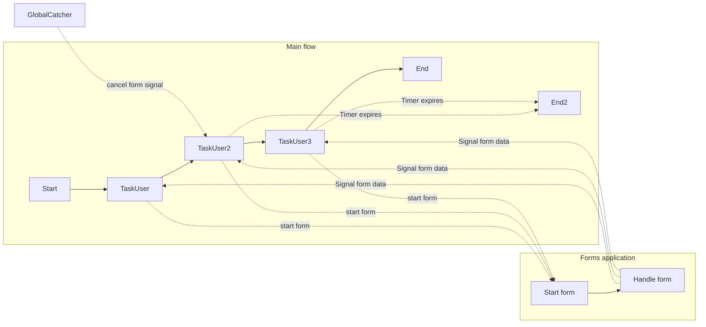

# Task User implementation with timers

## Prerequisites

1. Node 22

## Installation

In order to install all dependencies and format all files, run the following
command:

```shell
chmod +x install.sh && ./install.sh
```

### Running this sample

1. `temporal server start-dev` to start
   [Temporal Server](https://github.com/temporalio/cli/#installation).
2. In another shell, `npm run start.watch` to start the Worker.
3. In another shell, `npm run workflow` to run the Workflow Client.
4. Send a signal containing form data from the Temporal Web UI to the running
   workflow.

### Workflow

In this example, three forms are initiated, when the previous is submitted. For
every form, a signal handler is started , listening for signals containing the
submitted form data.

- The first form has no timer. Users can take as long as they need to complete
  and submit it.
- The second and third forms each have a timer defined. These forms must be
  submitted before the timer expires; otherwise, the processing is canceled or
  follows an alternative path. They also have a signal catcher attached. The
  form will be cancelled when the signal is caught.

### Example form submit data

Submit data is a JSON object containing key-value pairs. In typescript this is
translated to Record<string, any>:

```json
{
  "Test": "test"
}
```

### Workflow diagram


